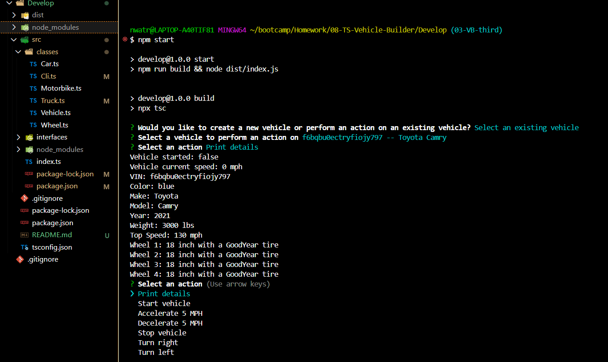

# Vehicle Builder

## Description
TypeScript command-line application that builds and uses cars to have additional options for motorbikes and trucks. The application prompts the user to create a new vehicle or select an existing vehicle. After going through the creation process or the selection process, the user is able to perform certain actions with the selected vehicle. The user is returned to the actions menu after each action until they decide to exit the application.

## Table of Contents
- [Installation](#installation)
- [Usage](#usage)
- [Credits](#credits)
- [License](#license)
- [Features](#features)
- [Tests](#tests)
- [Contact](#contact)

## Installation
Node.js, TypeScript.js, npm inquirer

## Usage
Run npm start in Terminal

## Credits
Nancy Watreas Feltman

## License
MIT

## Features
Vehicle information and functionality

## Tests
Confirm printout in the terminal

## Contact
If there are any questions or concerns, I can be reached at:
##### [github: noIDEA-tech](https://github.com/noIDEA-tech)
##### [email: nwatreas2023@gmail.com](mailto:nwatreas2023@gmail.com)
